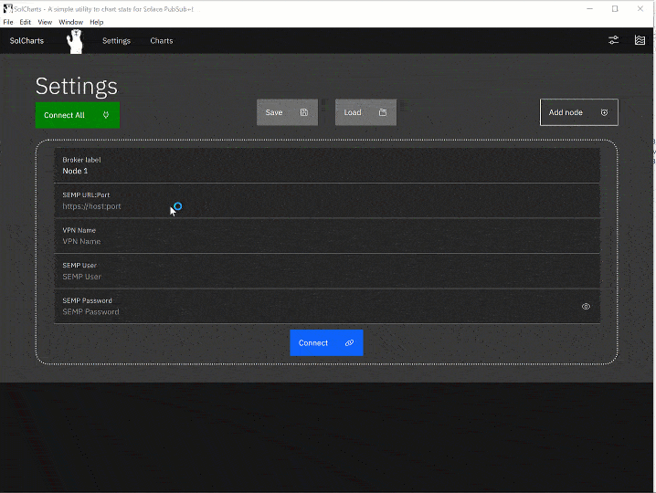

[](https://opensource.org/licenses/MIT) 

# [SolCharts](https://solacese.github.io/sol-charts) 
## A simple utility to chart stats from the Solace PubSub+ Event Broker - [Click here to launch](https://solacecommunity.github.io/sol-charts)

SolCharts uses SEMP commands to pull monitoring stats from Solace PubSub+ brokers. It completely runs on the client side and hence any credentials put into the tool does not get sent anywhere except the message broker to execute SEMP commands.

The tool has the following features:
* Ability to chart upto 5 message brokers
* Save/Load config to/from local files
* HTTP/s basic authentication to the Solace PubSub+ broker
* Upto 5 charts from the application
* Ability to chart 4 VPN attributes per broker
* Ability to chart client attributes
* Hosted on [github page](https://solacecommunity.github.io/sol-charts) or as a [standalone electron app](https://github.com/solacecommunity/sol-charts/releases/)


## Directions for usage



1. Add atleast 1 broker to the settings screen and connect
2. Navigate to the Charts section and select atleast 1 attribute to chart and click the start charting button
3. ???
4. PROFIT!

## Building the project

Install the dependencies...

```
cd sol-charts
npm install
```

...then start [Rollup](https://rollupjs.org):

```bash
npm run dev
```

Navigate to [localhost:5000](http://localhost:5000). You should see your app running. Edit a component file in `src`, save it, and reload the page to see your changes.

By default, the server will only respond to requests from localhost. To allow connections from other computers, edit the `sirv` commands in package.json to include the option `--host 0.0.0.0`.

If you're using [Visual Studio Code](https://code.visualstudio.com/) we recommend installing the official extension [Svelte for VS Code](https://marketplace.visualstudio.com/items?itemName=svelte.svelte-vscode). If you are using other editors you may need to install a plugin in order to get syntax highlighting and intellisense.

## Building and running in production mode

To create an optimised version of the app:

```bash
npm run build
```

You can run the newly built app with `npm run start`. This uses [sirv](https://github.com/lukeed/sirv), which is included in your package.json's `dependencies` so that the app will work when you deploy to platforms like [Heroku](https://heroku.com).


## Single-page app mode

By default, sirv will only respond to requests that match files in `public`. This is to maximise compatibility with static fileservers, allowing you to deploy your app anywhere.

If you're building a single-page app (SPA) with multiple routes, sirv needs to be able to respond to requests for *any* path. You can make it so by editing the `"start"` command in package.json:

```js
"start": "sirv public --single"
```

## Building an electron distribution

The `package.json` file contains helper scripts that will create a standalon electron distribution for your respective platform. 

You can run this by using the following commands:

* `npm run package-mac` - For a Mac distribution 
* `npm run package-win` - For a Windows distribution 
* `npm run package-linux` - For a Linux distribution

The releases will be present in the `release-builds` directory
